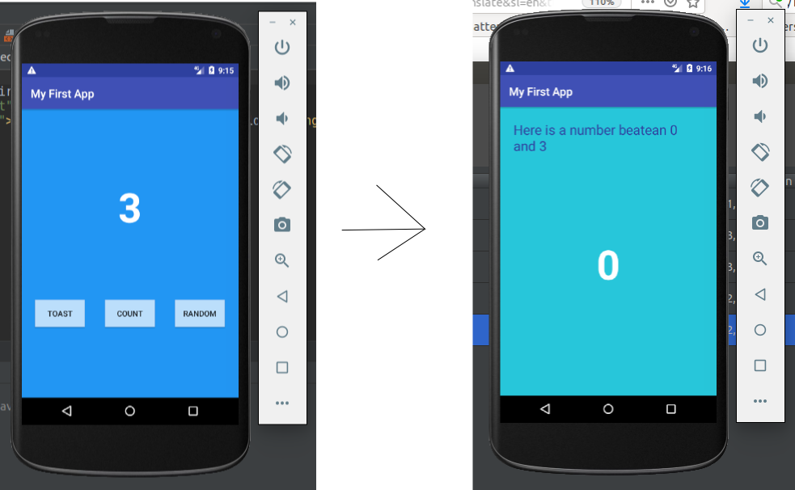

```txt

Google codeLab - https://codelabs.developers.google.com/codelabs/build-your-first-android-app/index.html#0

First Android App

minSdkVersion=16
compileSdkVersion=27

What I am learn:
    - Constraint Layout
    - Intent
```
